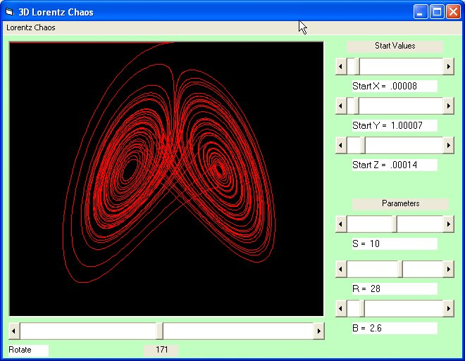



## Lorentz 3D Chaos

### Description

Graphical representation of the Lorentz Chaos Differential equations.This program lets you play with the Lorentz differential equations so that you can experience that a minute change in de starting values can cause unpredictable changes in the endresult. Because the figure is 3-dimensional, you can rotate the figure in space.These equations lay at the basis of 'the butterfly hypothesis'.Have fun!!!
 
### More Info
 

             |
---                |---
**Submitted On**   |2002-08-13 15:00:22
**By**             |[christine daniels](https://github.com/Planet-Source-Code/PSCIndex/blob/master/ByAuthor/christine-daniels.md)
**Level**          |Intermediate
**User Rating**    |4.6 (51 globes from 11 users)
**Compatibility**  |VB 6\.0
**Category**       |[Graphics](https://github.com/Planet-Source-Code/PSCIndex/blob/master/ByCategory/graphics__1-46.md)
**World**          |[Visual Basic](https://github.com/Planet-Source-Code/PSCIndex/blob/master/ByWorld/visual-basic.md)
**Archive File**   |[Lorentz\_3D1175018132002\.zip](https://github.com/Planet-Source-Code/christine-daniels-lorentz-3d-chaos__1-37798/archive/master.zip)

